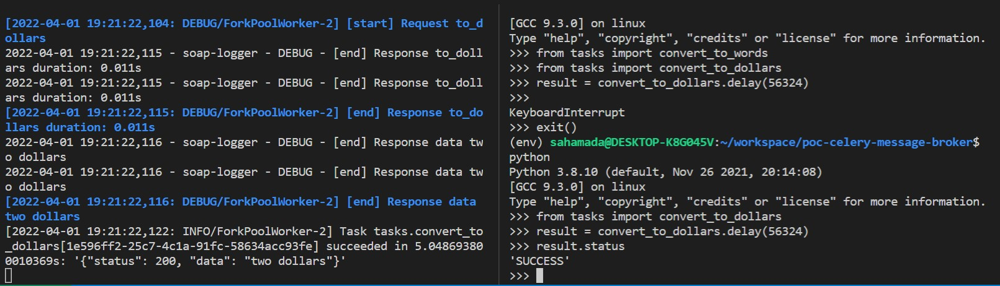

# Asynchronous tasks with celery 
Demo made with zeep as soap client and celery to manage the request asynchronously
Add a mock-server for soap endpoint 

## Installation

> Create virtual environments
```
 python -m venv env
```

> Activate virtual environment
```
source env/bin/activate 
```

> Install packages with pip
```
pip install -R requirements.txt
```

> Install dependencies wiremock + redis 
```
docker-compose up -d
```

## Usage

> Run celery worker server

```
celery -A tasks worker --loglevel=INFO
```

> Call the task to_words

```
$ python
>>> from tasks import convert_to_words
>>> result = convert_to_words.delay(56324)
>>> result.status
'SUCCESS'
```

> Call the task to_dollars

```
$ python
>>> from tasks import convert_to_dollars
>>> result = convert_to_dollars.delay(56324)
>>> result.status
'SUCCESS'
```


> See what happend in worker terminal




## Documentation


* [Soap client with zeep](https://docs.python-zeep.org/en/master/)

* [First steps with celery](https://docs.celeryq.dev/en/stable/getting-started/first-steps-with-celery.html#first-steps)

* [Next steps with celery](https://docs.celeryq.dev/en/stable/getting-started/next-steps.html#next-steps)

* [Celery guide](https://docs.celeryq.dev/en/stable/userguide/index.html#guide)

* [SOAP Service Mocking Overview](https://www.soapui.org/docs/soap-mocking/service-mocking-overview/)

## @Todo : try to replace the current soap mock server by wiremock

* https://stackoverflow.com/questions/35974249/using-wiremock-with-soap-web-services-in-java
* https://wiremock.readthedocs.io/en/latest/index.html
* https://dev.to/adevintaspain/testing-with-wiremock-docker-2gh9
* https://wiremock.org/docs/request-matching/
* https://www.taheramlaki.com/blog/articles/wiremock-stubbing-and-response-templating/