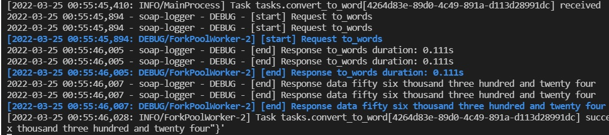

# Asynchronous tasks with celery 
Demo made with zeep as soap client and celery to manage the request asynchronously

## Installation

> Create virtual environments
```
 python -m venv env
```

> Activate virtual environment
```
source env/bin/activate 
```

> Install packages with pip
```
pip install -R requirements.txt
```

> Use Redis as message broker via docker 
```
docker run -d 6379:6379 redis
docker ps
```

## Usage

> Run celery worker server

```
celery -A tasks worker --loglevel=INFO
```

> Call the task

```
$ python
>>> from tasks import convert_to_word
>>> result = convert_to_add.delay(56324)
>>> result.status
'SUCCESS'
```

> See what happend in worker terminal




## Documentation


* [Soap client with zeep](https://docs.python-zeep.org/en/master/)

* [First steps with celery](https://docs.celeryq.dev/en/stable/getting-started/first-steps-with-celery.html#first-steps)

* [Next steps with celery](https://docs.celeryq.dev/en/stable/getting-started/next-steps.html#next-steps)

* [Celery guide](https://docs.celeryq.dev/en/stable/userguide/index.html#guide)

